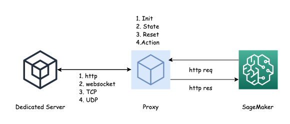

# AIBot-Proxy

## Architecture 




the proxy server has 2 purposes:

+ serving as a http server for sagemaker endpoint
+ playing as wss client for custom protocol adaptation

Moreover, it final implementation depends on the designer's categorization of the Dedicated server APIs, which usually refers to 4 domains: **Init** **State** **Reset** and **Action** , to complete the Reinforcement Learning Architecture


## How to start

### a testing websocket server port: 8765

python3 wsserver.py

### proxysrever (wssclient + httpserver)

python3 proxy.py runserver -h 0.0.0.0 -p 5000

### curl following apis

* http://0.0.0.0:5000/
* http://0.0.0.0:5000/init
* http://0.0.0.0:5000/state
* http://0.0.0.0:5000/reset
* http://0.0.0.0:5000/action

### how to config

```
[config]
# ws server location
remoteUri = ws://localhost:8765
# flask server key
secretKey = benxiwan
# flask server listen to 
listen = 0.0.0.0
port = 5000
# type of wss client payload: 0: str 1: bytes
binary = 0


[route]
init = []
action = []
reset = []
state = [1017,4096,4993]
```


